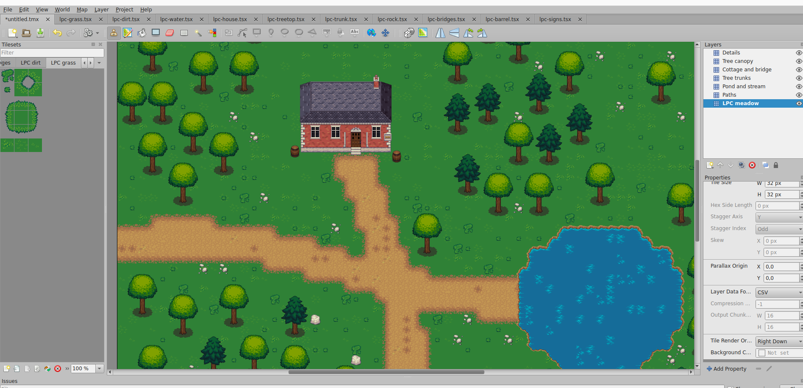

# Tiled AI

**Describe your map. Watch your AI build it in Tiled.**

Connect your AI assistant to [Tiled Map Editor](https://www.mapeditor.org/) through MCP. Start with a few images or an existing map, describe the scene you want, and let the assistant create tilesets, connect terrains and build directly in the editor.

[](docs/media/tiled-ai-demo.mp4)

**[▶ Watch the demo — 45 seconds, sped up](docs/media/tiled-ai-demo.mp4)**

## A map built 100% by AI

This demo was made with **Codex + GPT6 Astra**. The human specified the **LPC (Liberated Pixel Cup)** art style; Codex found the images itself, then used those images to create **TSX tilesets, a TMX map and Wang terrain sets**, arranged across multiple layers.

The map construction was handled entirely by the AI. **A second prompt was needed to refine the house.** The video is sped up, so it does not represent real-time generation speed.

The pixel artwork is by **Lanea Zimmerman (Sharm)**, from the LPC base assets. The AI assembled the scene using that existing artwork. Thank you to Sharm and the LPC community for making these assets available. [Artwork credits, sources and licenses →](docs/media/CREDITS.md)

## What you can ask for

- **Build a scene:** “Create a woodland cottage with a winding path, a pond and a bridge.”
- **Start from images:** “Turn these PNGs into tilesets, define the terrain transitions and create a new map.”
- **Improve a map:** “Refine this house and add details inside the selected area.”
- **Prepare gameplay:** “Add collision objects around the house and trees.”

You keep a normal Tiled project: editable layers, tiles, objects and properties. Map changes appear immediately and can be undone. Ask the assistant to save when you want TSX and TMX files on disk.

## Get started with your AI

You need **Tiled 1.12.2**, **Node.js 24+**, and an AI client with MCP and image support. The demo uses Codex; another compatible MCP client can use the same server. Local validation has been performed on Linux; Windows and macOS are not yet tested.

**1. Install the companion skill**

Run this in your project directory and select your AI agent when prompted:

```sh
npx skills add rpgjs/tiled-ai --skill tiled-ai
```

The skill gives your assistant the setup instructions and the workflow for working with Tiled. It is installed with the [Skills CLI](https://skills.sh/).

**2. Ask your assistant to set things up**

> Use the tiled-ai skill to set up this integration on my machine. Install the Tiled extension, configure the MCP server, start the shared bridge and verify access to the editor. Reuse any existing installation.

With local terminal access, the assistant can carry out the installation. The skill itself is a set of instructions; your assistant performs the setup. It may need you to restart Tiled to load the extension or refresh your AI client so the MCP tools become available. Prefer manual setup? See the [advanced guide](docs/advanced.md#manual-installation).

**3. Connect Tiled**

Start the MCP client and Tiled, open a map and select an area. Use **Map → Tiled AI: Connect** if Tiled is already running. **Disconnect** and **Status** are in the same menu. Reconnect explicitly after a connection loss.

Starting from scratch? Keep Tiled open and ask the assistant to create a new map instead.

**4. Describe what you want**

> Use tiled-ai to create a 24 × 20 woodland map from the images in my assets folder. Add a cottage, winding paths, a pond and a bridge, using separate layers. Inspect the images first, create the TSX tilesets and Wang terrain sets where appropriate, then build and check the result in Tiled. Save the TSX and TMX files in my output folder.

Give the assistant an accessible image path or HTTPS URL and a destination for the project. It can ask a focused question if the tile grid or terrain connections are ambiguous. You can also ask it to find artwork in a particular style, as in the demo; that search uses the AI client's own browsing tools.

## Advanced

The implementation details are in the [advanced guide](docs/advanced.md), so you can start building without learning the protocol first.

| Looking for… | Read this |
| --- | --- |
| Manual installation and MCP configuration | [Setup](docs/advanced.md#manual-installation) |
| Multiple AI tasks, server lifecycle and upgrades | [Shared bridge](docs/advanced.md#multiple-codex-tasks-and-upgrades) |
| Image import, TSX/TMX creation and Wang tools | [Image-to-map workflow](docs/advanced.md#image--tsx--tmx--terrain) |
| Supported orientations and known terrain limits | [Terrain limitations](docs/advanced.md#terrain-limitations) |
| Architecture, revisions, Undo and recovery | [Architecture and guarantees](docs/advanced.md#architecture-and-guarantees) |
| Reproducible examples and tests | [Development and validation](docs/advanced.md#examples-and-validation) |
| Instructions your assistant follows | [Companion skill](skills/tiled-ai/SKILL.md) |

Terrain painting currently supports orthogonal and isometric maps; ordinary editing supports all four Tiled orientations. An arbitrary image may not contain every tile needed for a complete terrain. Tiled AI creates map and tileset metadata and assembles existing pixels—it does not generate new artwork.
