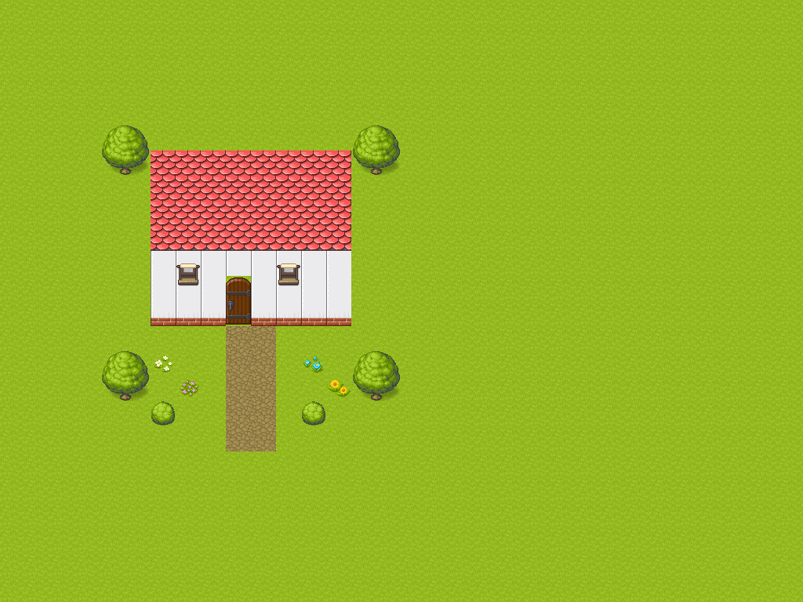
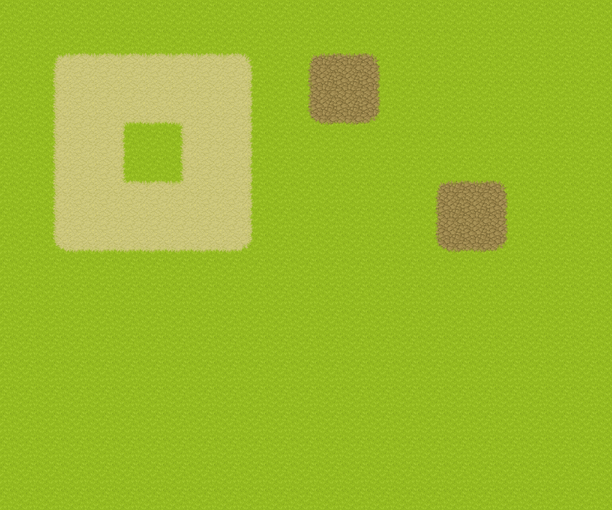

# Tiled AI

A TypeScript extension and MCP server for inspecting and editing live Tiled documents. A multimodal AI client can inspect tile images, build structures, create TSX tilesets from images, define Wang terrain sets and paint matching terrain through Tiled's API.



## Quick start

Requires Node.js 24 and Tiled 1.12.2. Tested on Linux with the Tiled AppImage. Windows and macOS have not been validated.

```sh
npm ci
npm run build
node dist/cli.mjs init
node dist/cli.mjs install --extensions "$HOME/.config/tiled/extensions"
```

Use the extensions directory shown in Tiled's preferences on other systems or custom installations. Installation copies the extension and its local configuration. The CLI generates a private local secret; never commit this configuration.

Configure your MCP client with an absolute path, adapting this example to its configuration format:

```json
{
  "mcpServers": {
    "tiled-ai": {
      "command": "node",
      "args": ["/path/to/tiled-ai/dist/cli.mjs", "serve"]
    }
  }
}
```

Start the MCP client and Tiled, open a map and select an area. Use **Map → Tiled AI: Connect** if Tiled is already running. **Disconnect** and **Status** are in the same menu. Reconnect explicitly after a connection loss.

Try: “Inspect the tilesets and build a house in the selected area, with a path to the door and collisions.” The client model must support images to choose tiles visually.

`node dist/cli.mjs doctor` shows local configuration paths and the port. Commands accept `--config /path/to/config.json`. To change the port, edit the local configuration and reinstall the extension using that same configuration. One server owns the port; multiple Tiled instances can connect with separate sessions.

## Image → TSX → TMX → terrain

1. `inspect_tileset_image` accepts an absolute local image path or HTTPS URL, including GitHub `blob` links. It returns dimensions, an image preview and possible grids. With a saved document as context it suggests a `tilesets` directory beside that document. Otherwise the agent asks for a destination.
2. `create_tileset_from_image` requires explicit grid dimensions, margin, spacing, name and absolute TSX output path. It imports the image next to the TSX, writes a relative image reference through Tiled's TSX writer, and opens the new tileset. Existing TSX files are never intentionally overwritten.
3. Inspect annotated pages with `get_tileset_images`, then use `create_wang_set` or `update_wang_set`. Edge, corner and mixed definitions use eight indices in Tiled order: top, top-right, right, bottom-right, bottom, bottom-left, left, top-left. Zero means no terrain; colors are numbered from one. Definitions and tile references are validated before editing.
4. If no map exists, `create_map` creates and opens a new TMX with explicit cell dimensions, tile dimensions and destination. It writes the initial blank map and refuses an existing destination. Then `attach_tileset` attaches an open tileset to the target map with a revision check and map Undo. `paint_terrain` prepares tiles with Tiled's Wang engine, validates the generated cells and applies one map Undo macro. Use `list_wang_sets` to obtain live IDs.
5. Verify the affected region and `get_region_image`. Use `save_tileset` and `save_map` when saving is requested. Map painting never saves the map automatically. Save external tilesets separately before sharing the TMX.

The exact [Grass example image](examples/grass/ATTRIBUTION.md) has a verified `pipoya-grass-48` profile: 32 × 32 cells in eleven blocks of 48 tiles. Recognition requires the image's SHA-256, not its name or dimensions alone. Other images receive grid candidates, not invented terrain assignments. An agent must inspect centers, edges and corners and ask a focused question when the evidence is ambiguous. Metadata generation does not create pixels or guarantee that an arbitrary image contains a complete terrain.



### Creating and saving maps

`create_map` requires `sessionId`, a unique `requestId`, an absolute `.tmx` `outputPath`, `width`/`height` in cells and `tileWidth`/`tileHeight` in pixels. It defaults to an orthogonal finite map with one `Ground` tile layer. Supply `layers` to choose initial tile layer names, `orientation` and `infinite` as needed. Staggered/hexagonal maps accept `staggerAxis` and `staggerIndex`; hexagonal maps require a positive `hexSideLength` bounded by the tile dimension on that axis. Initial dimensions are limited to 1,048,576 cells and 4,096 per axis.

The initial blank TMX is saved and opened; subsequent editing stays unsaved until requested. Creation returns `fileCreated`, `documentOpened`, `documentId` and a revision. File creation is not an Undo operation. If opening fails after writing, recover with `open_map` instead of recreating the file.

`save_map` takes the target document, fresh revision and unique request ID. With no `outputPath`, it saves the map's associated TMX and keeps the live document and Undo history. An optional different absolute `.tmx` path writes a new copy and refuses an existing file. This copy does **not** retarget the live document or clear its modified flag; the result reports `savedCopy`, `documentFilePath` and `modified`. This also allows exporting an untitled map. `open_map` opens that copy if needed. Saving a map does not save its external tilesets, and Undo does not revert a disk write.

### Terrain limitations

The painter supports square-cell Wang topology on orthogonal and isometric maps. Staggered and hexagonal maps return `UNSUPPORTED_TERRAIN_ORIENTATION` before mutation. Ordinary tile and object tools support all four orientations. Transformed neighboring terrain tiles require an explicit transformed definition and are currently rejected by the painter.

Painting takes a footprint of cells, intersected with the exact active selection. It preserves neighbors and rejects a boundary that would require editing outside that footprint. Missing patterns produce `MISSING_WANG_PATTERN`; a one-cell island is not possible with the supplied Grass profile. Variants may share a Wang ID. Tiled chooses among matching variants; the bridge verifies its result before applying it.

**Tiled 1.12.2 workaround:** native terrain-color renaming after increasing the color count can crash Redo. The extension stores names in the undoable `tiled-ai:terrain-names` Wang-set property. MCP returns those names immediately. Explicit `save_tileset` exports them to standard TSX color names; reopen the TSX to see updated native color labels. Ordinary Tiled Save preserves the property but may retain old native labels. The tileset Undo history remains usable until the document is closed. `save_tileset` currently supports TSX destinations only. The regression is exercised by the real integration test; the relevant native commands are [color count changes](https://github.com/mapeditor/tiled/blob/v1.12.2/src/tiled/changewangsetdata.cpp) and [color name changes](https://github.com/mapeditor/tiled/blob/v1.12.2/src/tiled/changewangcolordata.cpp).

## Architecture and guarantees

```text
AI client → MCP stdio → Node.js → local HTTP RPC → .mjs extension → Tiled API
```

- `packages/protocol`: shared Zod schemas, types, limits and errors.
- `packages/extension`: live documents, validation, editing, rendering and Undo.
- `packages/server`: MCP server, local bridge, request deduplication and annotated image sheets.

The extension targets ES2016 for Tiled's Qt engine, with small compatibility helpers and no Node runtime in Tiled. Asynchronous `XMLHttpRequest` long polling keeps the editor responsive. The bridge binds to `127.0.0.1`, requires a local secret and rejects browser requests with an `Origin` header. No arbitrary JavaScript or shell execution tool is exposed. Image imports, TSX/TMX creation and explicit saves are file-writing operations.

Document edits require a session ID, document ID, unique request ID and revision from `get_map_info`. Revisions include live content, selection and Wang definitions. References are checked before starting an Undo macro. Batch references resolve against the initial state; create layers before a batch that uses them. External tilesets have their own document and Undo history.

Tile coordinates are integer cells; object coordinates follow Tiled's native orientation conventions. Disjoint selections retain their exact mask. Tile operations refuse writes outside the active selection rather than relying on Tiled's silent clipping.

After a lost response, inspect `get_request_status`. A dispatched request may already have applied. Identical retries are deduplicated within the running session; a different payload cannot reuse its ID. Reconnecting the same extension can recover its cached result. After a server or extension restart, inspect documents and files before deciding what remains. TSX creation reports `fileCreated` and `documentOpened`; attachment is a separate request. Recover an existing TSX with `open_tileset`, then check whether it is already attached. Use `open_map` for an existing TMX. A staged image may remain after failed creation. Do not blindly repeat a file creation or mutation.

Unexpected native edit errors report completed operations and whether the failing operation may have changed the document. File saving is explicit and is not undone by document Undo.

Limits: 16,384 cells per region/batch; 256 data items or 64 tile images per page; revision inspection of at most 1,048,576 occupied-region cells; at most 32 retained revisions with earlier eviction to bound memory. Image imports are limited to 16 MiB and 16 megapixels, using non-animated PNG, JPEG or WebP. Custom class/enum properties are readable but not writable. Structures accept tiles and unrotated geometric objects; ordinary object tools also support text, tile objects and rotation.

See the [tool reference](skills/tiled-ai/references/tools.md) and [terrain workflow](skills/tiled-ai/references/terrain.md).

## Companion skill

```sh
npx skills add . --skill tiled-ai
```

The [tiled-ai skill](skills/tiled-ai/SKILL.md) guides inspection, visual tile choice, grid recognition, TSX/Wang creation, bounded painting and recovery. It uses the configured MCP server and contains no model. The Skills CLI installs instructions; it does not configure MCP.

After you publish this repository, install it with `npx skills add <owner>/<repo> --skill tiled-ai`. Publication is optional and is not performed by the setup scripts.

## Examples and validation

```sh
npm run demo:assets
npm run demo:grass:assets
npm run check
npm run test:tiled
npm run test:terrain
# Explicitly regenerate the saved examples:
node scripts/test-tiled.mjs --terrain --demo
```

Tests resolve `TILED_APPIMAGE` first, then `tiled` from `PATH`, and fail clearly when neither is available:

```sh
TILED_APPIMAGE=/path/to/Tiled.AppImage npm run test:terrain
# On Linux without a display:
xvfb-run -a npm run test:terrain
```

Real integration tests launch Tiled and an MCP client with isolated configuration, data and cache under `.tmp`. Test-only editor controls are never shipped in the extension. They verify live edits, revision conflicts, lost responses, Undo/Redo, file creation/reopening, terrain boundaries, holes and negative coordinates. Unsupported terrain orientations are tested as explicit errors.

The house uses [start.tmx](examples/rpgjs/start.tmx), [house.tmx](examples/rpgjs/house.tmx) and the deterministic recipe in `scripts/house.mjs`. The Grass example is generated from its PNG alone; the companion source TSX is read only as an independent test oracle after generation. Generated assets are in [examples/grass](examples/grass), including the TSX, map, preview and pinned source hashes. See [house attribution](examples/rpgjs/ATTRIBUTION.md), [Grass attribution](examples/grass/ATTRIBUTION.md) and the [real Tiled test report](examples/rpgjs/validation.json).

`npm run check:public` scans distributable files for personal paths, credential patterns and accidentally included runtime files. `.tmp`, dependencies and build outputs are excluded; tracked files are also checked when Git is available. This is a targeted accidental-disclosure check, not a guarantee that all secrets can be recognized. Keep runtime configurations, environment files, logs and private keys out of Git.
